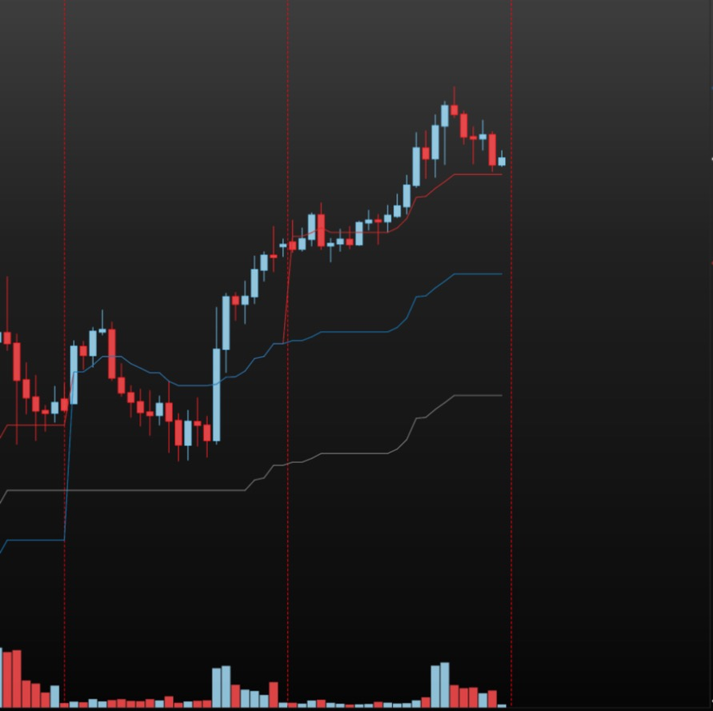

# Median Price for MotiveWave

**English** | [Русский](README.ru.md)

[](LICENSE)


Three lines on your chart: the **median price — (high + low) / 2 — of the current day, week and month**. The midpoint of the range so far, the "half-back" level of Market Profile and ICT-style trading, drawn automatically on any timeframe.



> **Display only.** The indicator is a plain MotiveWave *Study*. It has no access to the order API and **cannot place, modify or cancel orders**.

## What it draws

- **Day, week and month median** in one indicator. Each line has its own on/off switch, color, width and dash style.
- **Step lines, no look-ahead.** The value drawn at each bar is the value that existed at that bar. When the day makes a new high or low, the line steps; it never rewrites the past. The lines end at the last bar (they are not extended to the right) and carry no labels.
- **Closed bars only.** The forming bar never moves the median; the line holds the value of the last *closed* bar, so it does not flicker.
- **Three session modes.**
  - **Globex** (default): the CME day, 18:00–17:00 New York; the week runs Sunday 18:00 – Friday 17:00; the month follows the trade date.
  - **US RTH only**: regular trading hours of the product (ES/NQ/YM/RTY and their micros 09:30–16:00, CL/MCL/QM 09:00–14:30, GC/MGC 08:20–13:30). After the close the line is frozen. Any other product: type the hours yourself (*Custom hours*).
  - **Mix**: the day line is the Globex overnight range, switches to the RTH range during regular hours and goes back to Globex after the close; week and month stay on Globex.
- **Show both**: Globex and RTH lines side by side (the RTH set is dashed, with its own colors).
- **Straight line** (optional): each segment is drawn flat at its latest value instead of as steps.
- Times are taken in the exchange's time zone (America/New_York), so your own time zone and daylight saving never matter.
- **Correct on a short chart.** Week and month ranges are read from a finer helper series (5-minute bars by default, setting *Range data bar size*) that MotiveWave loads for the whole month, so the values are right even when the chart itself shows only a few days.

The gear icon in the chart legend opens a small panel with the session, *Show both*, *Straight line* and the line colors; *All Settings* opens everything.

## Install

1. Download `MedianPrice.jar` from the [latest release](../../releases/latest).
2. Put it into the **`MotiveWave Extensions`** folder in your user home folder (MotiveWave scans it automatically; on macOS: `~/MotiveWave Extensions` — create the folder if it does not exist).
3. Restart MotiveWave. The indicator appears under **Study → Alex Indicators → Median Price**.

> The menu folder is called *Alex Indicators* (the author keeps all their MotiveWave indicators there). If you build from source, rename it with the `MENU_GENERAL` line in `median_price/nls/strings.properties`.

> Tested on macOS with MotiveWave 7.1.1 and CME futures (MNQ). The jar is plain Java and should work on Windows too, but that has not been tested.

## Good to know

- **Add it as a new indicator after updating.** The helper series that makes week and month correct is attached only to an indicator that was *created* with this version. An older instance falls back to the chart's own bars (the journal says so); delete it and add it again.
- A median is a plain arithmetic midpoint. Nothing here claims that price reacts to it — judge it on your own charts.
- The indicator writes a small journal of what it calculated to `~/Library/MotiveWave/MedianPrice/` (macOS), useful for checking a value.

## Build from source

Requirements: a JDK (17 or newer), `mwave_sdk.jar` and the JavaFX jars (`javafx.*.jar`) from your own MotiveWave installation — none of them is included in this repository. On macOS `build.sh` finds all of it inside `/Applications/MotiveWave.app` by itself.

```bash
bash build.sh            # builds build/MedianPrice.jar and runs the tests
bash build.sh install    # also copies it into ~/MotiveWave Extensions
```

Different locations: `MW_SDK=/path/to/mwave_sdk.jar MW_EXT=/path/to/extensions bash build.sh install`.

You can check the "no orders" claim yourself: `javap -v` on the compiled classes shows no reference to `order_mgmt` or `OrderContext`.

## Changelog

**0.3.0** — first public release. Week and month ranges from a helper series (right values on a short chart); session modes Globex / US RTH / Mix, *Show both*, *Straight line*; menu folder *Alex Indicators*.

## Disclaimer

This is an independent, community project. It is **not affiliated with, endorsed by or supported by MotiveWave**; "MotiveWave" belongs to its owners. The indicator is a calculation aid, **not trading or financial advice**. Markets carry risk — verify every number yourself before you trade.

## License

[MIT](LICENSE) © 2026 Zen Trader
